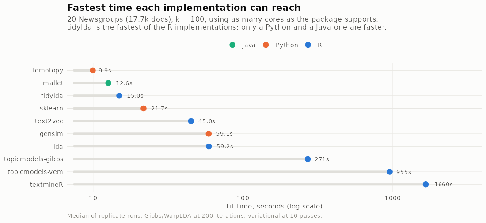
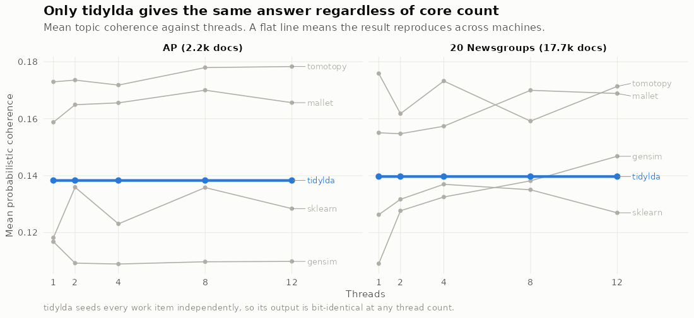
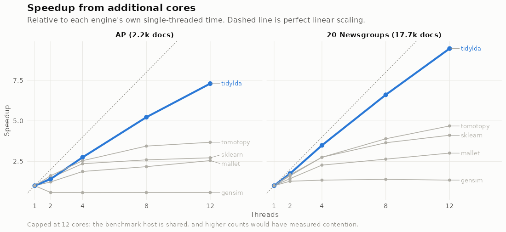
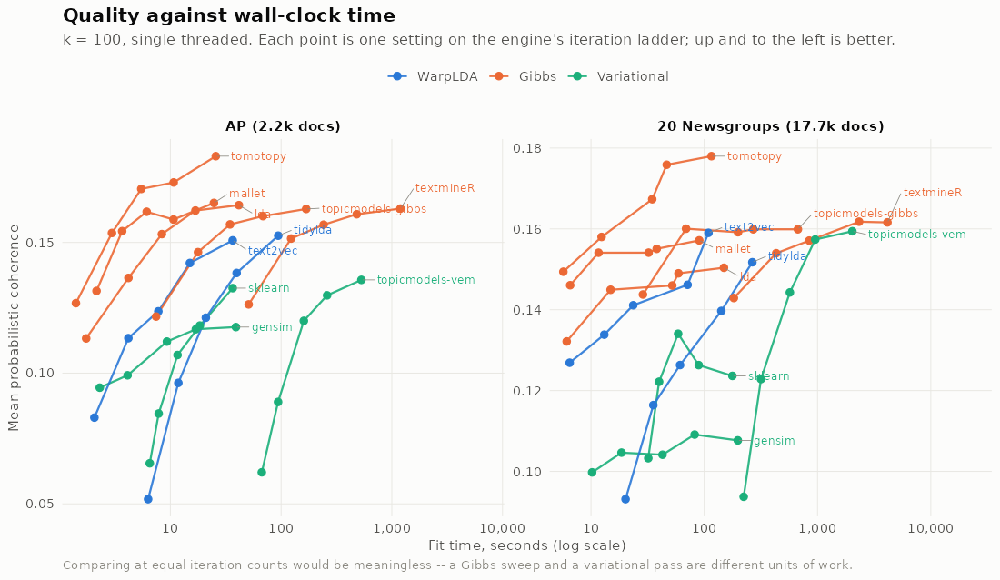
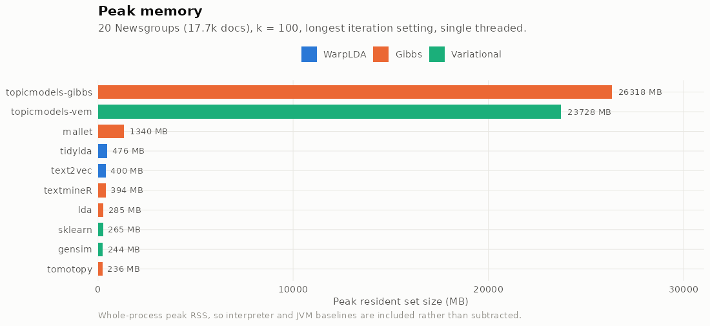

# LDA implementations in R and Python: a bake-off

Ten LDA implementations across R, Python and Java, fit on identical document-term matrices
with identical hyperparameters, and scored by one common code path. Built to find out where
[tidylda](https://cran.r-project.org/package=tidylda) actually stands in the ecosystem.

Blog-post rigor, not paper rigor: one machine, three replicates where the corpus is cheap
enough, no statistical testing. 342 runs, zero failures. Every number below is in
[`results/runs.csv`](results/runs.csv).

---

## Headline findings

**1. tidylda is the fastest LDA sampler implemented natively in R**, by about 3× over the
next one. The only implementations that beat it are a Python C++ extension and a Java program.

**2. It is the only implementation whose results do not change with thread count.** Every
other threaded engine here gives a different answer depending on how many cores it ran on.

**3. It is not the fastest overall.** tomotopy and MALLET are faster, and tomotopy also leads
on quality. Both are shown alongside throughout.

### Speed



Best time each implementation can reach on 20 Newsgroups, k = 100, using as many cores as the
package supports:

| Implementation | Language | Best time | Cores used |
|---|---|---|---|
| tomotopy | Python | 9.9 s | 12 |
| mallet | Java | 12.6 s | 12 |
| **tidylda** | **R** | **15.0 s** | 12 |
| sklearn | Python | 21.7 s | 12 |
| text2vec | R | 45.0 s | 12 |
| gensim | Python | 59.1 s | 8 |
| lda | R | 59.2 s | 1 |
| topicmodels-gibbs | R | 271 s | 1 |
| topicmodels-vem | R | 955 s | 1 |
| textmineR | R | 1660 s | 12 |

`text2vec` and `textmineR` are single threaded and cannot use more cores: text2vec's warpLDA
has no OpenMP anywhere in `src/mcemlda/`, and textmineR 3.0.6's `FitLdaModel()` has no
threading argument at all. Both were measured flat across the full sweep before being
labelled that way.

### Reproducibility across machines



Swing in mean topic coherence across 1–12 threads. Lower is more reproducible:

| Implementation | AP | 20 Newsgroups |
|---|---|---|
| **tidylda** | **0.0%** | **0.0%** |
| tomotopy | 3.7% | 9.9% |
| mallet | 6.8% | 9.5% |
| gensim | 7.0% | 28.8% |
| sklearn | 13.8% | 8.1% |

tidylda seeds every work item independently and holds the topic-count vector read-only within
a pass, so its output is bit-identical at any thread count — verified by
[`scripts/98-verify.R`](scripts/98-verify.R), which also confirms that this benchmark's
scoring reproduces tidylda's own native R² and coherence exactly.

### Thread scaling



tidylda is the best scaler in the set — 9.46× on 12 cores versus tomotopy's 4.69× and
MALLET's 3.01× — and it was still climbing near-linearly at the cap. The sweep stops at 12
because the benchmark host is shared; the crossover where tidylda would overtake, if it
exists, is above the range measured here.

### Quality against wall-clock time



Comparing engines at equal iteration counts would be meaningless — a Gibbs sweep and a
variational pass are different units of work. So each engine is run at a ladder of iteration
counts and we plot the quality it reached against how long it took. Up and to the left is
better; a curve that sits above and left of another dominates it.

At the top of each ladder (20 Newsgroups, k = 100, single threaded):

| Implementation | Iterations | Time | Peak RSS | R² | Coherence |
|---|---|---|---|---|---|
| tomotopy | 500 | 116 s | 236 MB | 0.590 | 0.1780 |
| textmineR | 500 | 4144 s | 394 MB | 0.553 | 0.1616 |
| topicmodels-gibbs | 500 | 671 s | 26318 MB | 0.542 | 0.1599 |
| topicmodels-vem | 25 | 2030 s | 23728 MB | 0.550 | 0.1594 |
| text2vec | 500 | 109 s | 400 MB | 0.542 | 0.1590 |
| mallet | 500 | 90 s | 1340 MB | 0.544 | 0.1572 |
| tidylda | 500 | 266 s | 476 MB | 0.546 | 0.1517 |
| lda | 500 | 149 s | 285 MB | 0.503 | 0.1504 |
| sklearn | 25 | 177 s | 265 MB | 0.537 | 0.1236 |
| gensim | 25 | 198 s | 244 MB | 0.481 | 0.1077 |

R² lands in a tight band for everything except gensim and `lda`. Coherence spreads a little
wider, with tomotopy ahead on both corpora and the variational engines trailing.

### Memory



Whole-process peak RSS, so interpreter and JVM baselines are included rather than subtracted.
topicmodels is the outlier by an order of magnitude, at 26 GB on 20 Newsgroups.

---

## What is compared

| Engine | Language | Family | Threads |
|---|---|---|---|
| tidylda | R | WarpLDA (Metropolis-Hastings) | `threads` |
| text2vec | R | WarpLDA | single threaded |
| textmineR | R | collapsed Gibbs | single threaded |
| topicmodels (Gibbs) | R | collapsed Gibbs | single threaded |
| topicmodels (VEM) | R | variational EM | single threaded |
| lda (Chang) | R | collapsed Gibbs | single threaded |
| MALLET | Java | collapsed Gibbs (SparseLDA) | `--num-threads` |
| gensim | Python | online variational Bayes | `workers` |
| scikit-learn | Python | online variational Bayes | `n_jobs` |
| tomotopy | Python | collapsed Gibbs | `workers` |

The inclusion criterion is *popular and easy to use from R or Python*. Faster implementations
exist — the reference WarpLDA code beats everything here — but they are not something you can
`install.packages()` or `pip install` and call from a normal analysis, so they are out of
scope. `stm` is excluded as a different model rather than an LDA implementation. Transfer
learning, which only tidylda offers, is also out of scope.

Two things worth knowing before reading the results:

- **tidylda 0.1.0 is a WarpLDA sampler, not collapsed Gibbs** (that changed after 0.0.7), so
  its closest algorithmic neighbour here is text2vec, not textmineR.
- **tomotopy is not doing anything clever algorithmically.** `LDAModel.hpp` runs the plainest
  textbook collapsed Gibbs — O(K) per token, no SparseLDA, no alias table, no MH — but the
  likelihood vector is one Eigen expression, the prefix sum is hand-written SIMD, and the
  wheel ships sse2/avx/avx2/avx512 variants and dispatches at import. On this host it runs
  AVX-512. Its speed is constant-factor engineering, not asymptotics.

## How the comparison is kept fair

**One shared DTM.** Every engine fits the same `dgCMatrix` with the same vocabulary in the
same column order. Python and MALLET are handed that vocabulary index directly rather than
tokenizing for themselves.

**One scorer.** No engine reports its own numbers. Every run writes back `phi` (k × V) and
`theta` (D × k); [`scripts/03-score.R`](scripts/03-score.R) normalizes them, asserts they
satisfy the contract, and pushes all of them through the same two functions:

- **Probabilistic coherence** — `tidylda::calc_prob_coherence(beta, dtm, m = 5)`, averaged over topics.
- **R²** — `mvrsquared::calc_rsquared(y = dtm, yhat = list(x = rowSums(dtm) * theta, w = phi))`.

Both are in-sample, computed on the training DTM. That is how tidylda reports them natively.

**Identical hyperparameters, no tuning.** `alpha = 0.1` per topic, `eta`/`beta = 0.05`, and
every engine's hyperparameter optimizer explicitly disabled. Where a package has a different
convention the runner converts: MALLET's `--alpha` is the sum over topics, so it gets `k * 0.1`.

**The iteration axis is not comparable across engines, and one case is worse than it looks.**
Beyond the Gibbs-vs-variational mismatch, text2vec's `fit_transform(n_iter = N)` runs N passes
with `update_topics = TRUE` and then, inside `transform_internal()`, a *second* run of N passes
with topics frozen to infer the document-topic matrix. At the same nominal `n_iter` it does
roughly twice the passes of every other engine. This does not affect the quality-vs-time
frontier, which never uses the iteration count as an axis, but no per-iteration claim should be
made from the raw `iters` column.

**One OS process per run**, launched under `/usr/bin/time -v`. That puts peak RSS on the same
footing across R, Python and the JVM, and stops runs from contaminating each other.

Two clocks are recorded. `fit_sec` is measured inside the runner and spans "here is the shared
DTM" through "training complete" — reshaping the matrix into whatever form the package demands
is included, because that is a real cost of using the package; extracting `phi`/`theta`
afterwards is excluded, because for some engines (gensim especially) that is an extra inference
pass that only our measurement protocol asks for. `wall_sec` is the whole process including
interpreter startup.

## Corpora

| | docs | terms | tokens |
|---|---|---|---|
| `nih` (smoke test only) | 99 | 1,309 | 14,318 |
| `ap` (Associated Press, ships with topicmodels) | 2,242 | 9,172 | 424,341 |
| `20ng` (20 Newsgroups via sklearn) | 17,669 | 20,926 | 1,456,595 |

Both real corpora are pruned identically: terms in fewer than 5 documents or more than half of
them are dropped, then documents under 5 tokens, iterated to a fixed point.

## Reproducing

```bash
make setup     # GSL, R packages, Python venv, JDK + MALLET -- all into ~/opt, no root
make corpora
make smoke     # one cheap run per engine; do this first
make run       # the full grid, resumable
make score     # -> results/runs.csv
make figures   # -> results/figures/*.png
make report    # -> results/04-report.html
```

The full HTML report ([`results/04-report.html`](results/04-report.html)) has the same charts
plus the k-sweep, the per-run table, and the environment record. It needs to be downloaded or
hosted to view, which is why the results are reproduced above.

tidylda 0.1.0 is [on CRAN](https://cran.r-project.org/package=tidylda). These runs predate its
acceptance and used a source build of the same version at commit `14e02b7`, recorded in
[`results/env/tidylda-provenance.txt`](results/env/). `setup/install-r-deps.R` still prefers
that local tree so a re-run reproduces the exact binary behind these numbers; edit it to
benchmark the CRAN build instead.

## Caveats

- One machine (24 cores, 125 GB), one OS, one set of library versions. See [`results/env/`](results/env/).
- The host is shared. Thread levels stop at 12 because another workload held roughly 7 cores
  throughout; higher counts would have measured contention rather than the samplers.
- Metrics are in-sample. A held-out comparison would be a different, larger project.
- Coherence and R² measure different things and need not agree; both are reported.
- Peak RSS includes interpreter and JVM baselines rather than subtracting them.
- `fit_sec` for MALLET is measured around the `train-topics` subprocess and so includes JVM
  startup; its corpus import step is excluded as corpus preparation.
